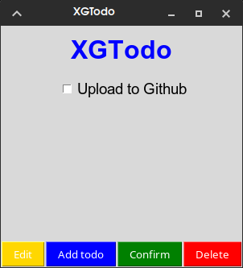

<h3 align="center">
  
  # XGTodo
</h3>

<p align="center">
  
</p>

<h3 align="center">A simple and lightweight Todo app built with Python and Tkinter.</h3>

<p align="center">
  <a href="https://github.com/ABX532/XGTodo">GitHub</a>
  ·
  <a href="https://github.com/ABX532/XGTodo/issues">Issues</a>
</p>

---

## ✨ Features

* 📝 Simple Todo management
* 🖥️ Clean graphical interface
* ⚡ Lightweight and fast
* 🐍 Built with Python
* 🎨 Uses Tkinter
* 📦 Minimal setup
* 💻 Designed to stay simple and easy to use

## 📸 Screenshot


  


## 🛠️ Requirements

* Python 3
* Tkinter

### Install Tkinter

```bash
pip install tkinter
```

## 🚀 Getting Started

### 1. Clone the repository

```bash
git clone https://github.com/ABX532/XGTodo.git
cd XGTodo
```

### 2. Run XGTodo

```bash
python3 main.py
```

That's it. No complicated setup required.

## 📁 Project Structure

```text
XGTodo/
├── main.py
├── xgtodo.png
├── LICENSE
└── README.md
```

## 🤝 Contributing

Contributions are welcome!

If you have an idea, find a bug, or want to improve the project:

1. Fork the repository
2. Create a new branch
3. Make your changes
4. Commit your changes
5. Open a Pull Request

You can also open an [Issue](https://github.com/ABX532/XGTodo/issues) to report bugs or suggest features.

## 📄 License

XGTodo is free and open-source software licensed under the **GNU General Public License v3.0**.

See the [LICENSE](LICENSE) file for the full license text.

---

<p align="center">
  Made with ❤️ and Python by <a href="https://github.com/ABX532">ABX532</a>
</p>
